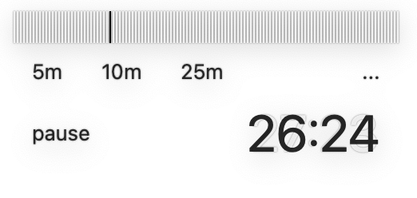

# A. what



Minimal Floating Timer

만들게 된 계기: 아니 어떻게 타이머 앱이 2만 2천원?

# B. feature

1. timer(decremental, incremental)
2. floating
3. keyboard shortcuts
4. accumulate time

# C. shortcut

```
1. esc: switch between transparent mode && minimal timer mode
2. spacebar: start/pause decremental timer
3. command + s: start/pause increment timer
4. command + 1: 5m
5. command + 2: 10m
6. command + 3: 25m
7. 숫자키: 시간 설정(in minute)
```
