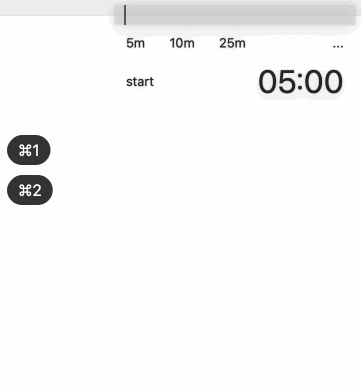

# A. 소개

## a. 단축키 특화 floating timer


1. Minimal View
	- `feat`: write TODO
	- `feat`: decremental timer(press spacebar, 시간 누적 O)
	- `feat`: incremental timer(press command + s, 시간 누적 X)
	- `feat`: 총 누적시간 / 오늘 누적시간 기록
2. Timer View
3. Calendar View
	- `feat`: 총 streaks / 최신 streaks 기록
	- `feat`: calendar에 해당 날짜에 몇시간 한지 기록
	- `feat`: 이전 달, 다음 달을 h,l 키로 이동


## b. keyboard shortcut

```
- spacebar: start/pause decremental timer
- command + s: start/stop increment timer
- 숫자키: 시간 설정(in minute)
- command + 1: minimal timer mode
- command + 2: transparent timer mode
- command + 3: calendar mode
- i: insert mode(set goal on minimal_timer)
- esc, enter: exit insert mode
- h,l to switch months in calendar
```

# B. Design Decisions

## 1. parkinson's law

[파킨슨의 법칙](https://en.wikipedia.org/wiki/Parkinson%27s_law)에 의하면,

> "Work expands to fill the available time"

똑같은 일을 15분 할당하면 15분만에 풀집중해서 끝내는데,\
**2시간 할당하면 질질 끌다가 2시간 맞춰서 끝낸다.**

타이머로 각 일마다 내 능력에 맞게 적정 시간을 할당할 수 있다.


## 2. 단축키로 타이머 세팅 귀찮음 문제 해결
15분마다 타이머 시간/할일 재설정하는게 매우 귀찮다는 단점이 있다.

단축키를 쓰면 타이머 세팅에 신경을 덜 쓰게 되어 몰입을 깨는걸 줄일 수 있다.


## 3. TODO의 단점인 feeling overwhelmed 문제 해결

TODO list에 오늘 할일 15개 적어놓으면 양에 압도되어 하기 싫어진다.

이 타이머에 적는 TODO는 블록 사이즈가 작고 하나밖에 못적기 때문에\
바로 눈 앞에 할일 위주로 집중하게 된다.

## 4. every second counts

공부는 10분 해봤자 쌓인게 체감이 안된다. 그래서 안하게 된다.

RPG게임이 지루하지만 매일 조금씩이라도 계속 하는 이유 중 하나가,\
몬스터 10분 잡으면 경험치 몇퍼센트 올랐는지 정확시 수치로 뜬다.\
보상이 확정적이다.

이 앱을 쓰면 매일 1분이라도 하면, 했다고 체크표시 뜨고,\
총 누적시간에 더해진다.\
총 누적시간은 1만시간에 가까워 질 수록 expert에 가까워 지는 것이다.


## 5. planning의 재미

1. 내 능력에 이 일은 몇분만에 끝내겠는데? 예측하고
2. 진짜 그만큼 걸렸는지 확인하고
3. 내 예상이 틀렸으면 시간 예측치를 수정하는 일

...을 하기 때문에,\
일종의 목표가 메타인지력 기르기인 게임을 하는 것과 구조가 비슷하다.


## 6. streaks
current streaks & max streaks는 매일 하게끔 약간 동기 부여한다.

30일 연속으로 했는데,\
1분만 하면 유지되는데,\
이걸 그만둘꺼야?

그렇게 매일 조금씩이라도 하게 시스템적으로 유도한다.\
매일 10분이라도 하는게 안하는 것 대비 습관형성에 도움된다.
