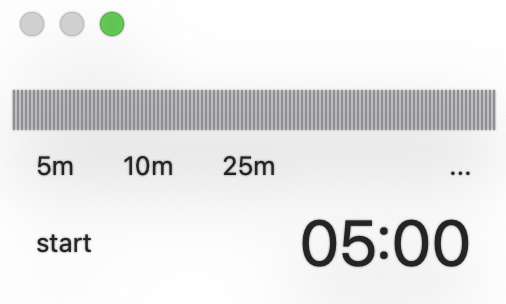
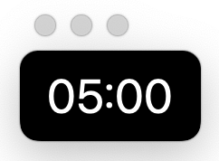

# A. what




Minimal Floating Timer

만들게 된 계기: 아니 어떻게 타이머 앱이 2만 2천원?

# B. feature

1. timer
2. floating
3. keyboard shortcuts

# C. shortcut

```
1. spacebar: 타이머 시작/중지
2. command + 1: 5m
3. command + 2: 10m
4. command + 3: 25m
5. esc: switch to transparent mode
6. 숫자키: 시간 설정(in minute, transparent mode only)
```
